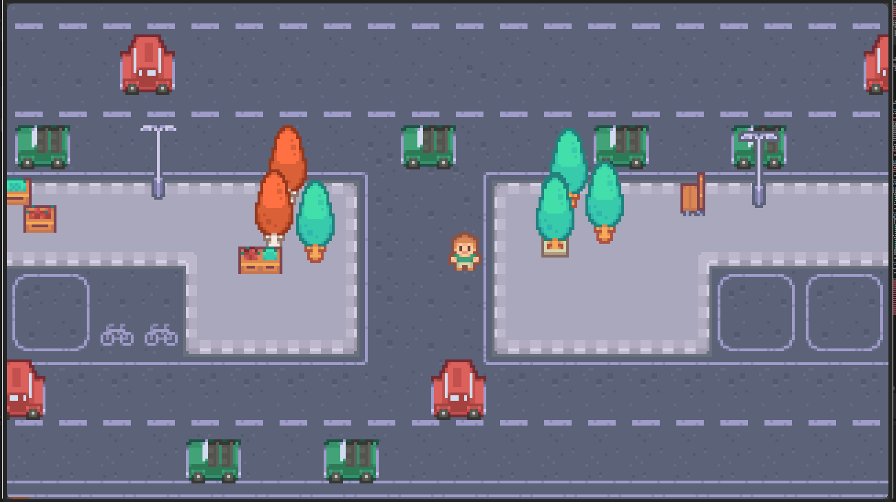

# Cross or Crash

Watch out for cars!

## Description

Cross or Crash is a fast-paced arcade game where the player's goal is simple: cross a busy road without getting hit by a vehicle.

The player controls a small character positioned between multiple lanes of moving traffic. To reach the other side, they must carefully move across the road while watching the vehicles approaching from different directions.

The game is easy to understand, but timing and movement are critical. A single mistake can result in the player being hit by a vehicle.

### Core Objective

The objective is straightforward:

Get from one side of the road to the other without getting hit.

The player must navigate through multiple lanes of traffic and find safe moments to move forward.

### Gameplay

The player starts on one side of the road and must move toward the opposite side.

Different vehicles continuously travel along the road, including cars, buses, and other traffic. Vehicles move through different lanes and can approach the player from either direction.

The player needs to:

Watch the traffic.
Identify gaps between vehicles.
Move across the road at the right moment.
Avoid collisions.
Reach the opposite side safely.

The challenge comes from having to make decisions while the traffic is constantly moving.

### Traffic System

The road consists of several lanes, with vehicles moving continuously along them.

Different lanes can have different traffic patterns and speeds. This means the player cannot simply move forward without looking.

For example, the player may safely cross one lane but then have to stop because another vehicle is approaching in the next lane.

This creates a rhythm:

Observe → Move → Stop → Observe → Move again

Risk and Reward

Moving quickly reduces the amount of time the player spends on the road, but moving too quickly can cause a collision.

Moving slowly gives the player more time to observe traffic, but it also keeps them exposed to approaching vehicles for longer.

The player therefore has to balance speed and safety.

### Collision

If the player comes into contact with a vehicle, they crash.

The game can then either:

Restart the current attempt.
Reduce the player's lives.
Return the player to the starting position.

This creates a simple failure condition that is immediately understandable.

### Screenshots

### Controls

- Move: `W` `A` `S` `D` or Arrow Keys

## Getting Started

1. Install [Godot 4.7](https://godotengine.org/download/)
2. Clone the repo and open it in Godot
3. Hit Play (F5)

Or play it [in your browser](https://khushnaseiba.github.io/crossorcrash/)
